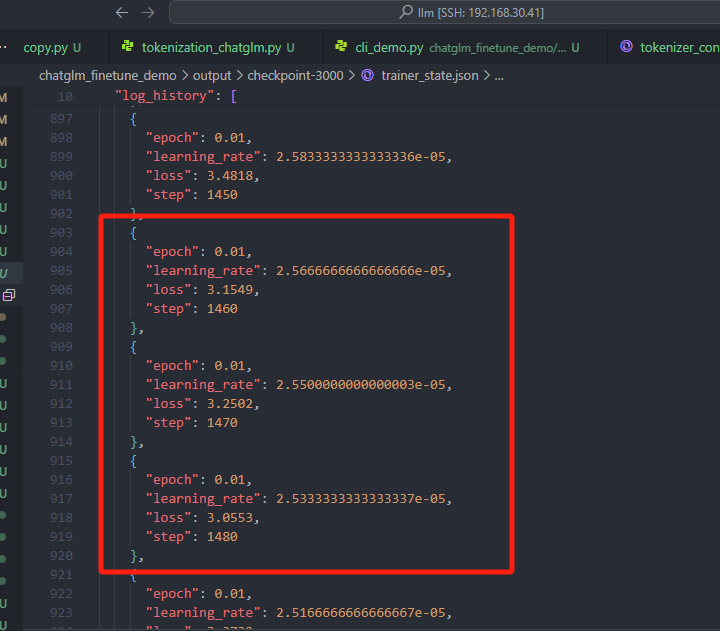
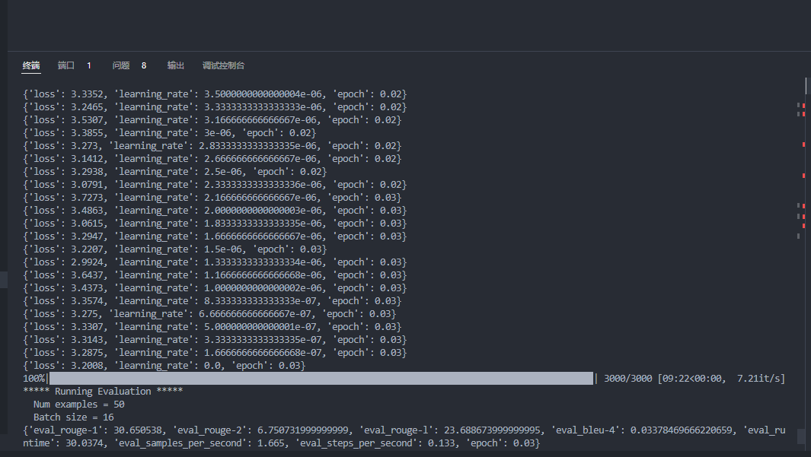
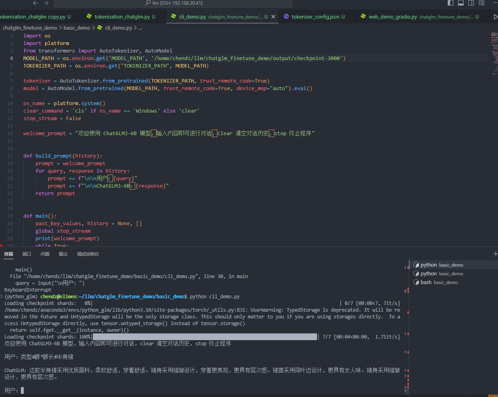

#ChatGLM微调

 

CUDA_VISIBLE_DEVICES=0 python  finetune.py data/AdvertiseGen_fix /home/chendz/llm/model/chatglm3-6b configs/lora.yaml 

CUDA_VISIBLE_DEVICES=0 python  inference.py output/checkpoint-3000/ --prompt 类型#群*群长#半身裙 

#问题处理

## 使用finetune.py的lora微调之后，用inference.py做推理了的时候报错NotImplementedError
在chatglm3-6b-base/modeling_chatglm.py文件里ChatGLMModel类增加方法def set_input_embeddings(self, value): self.embedding.word_embeddings = value

## 使用推理脚本inference_hf时报错：AttributeError: can't set attribute 'eos_token'如何解决
## 使用inference进行导入出现RuntimeError: CUDA error: device-side assert triggered Compile with TORCH_USE_CUDA_DSA to enable device-side assertions
重新安装0.7.1再训练，推理才正常的；transformers==4.37.2 peft==0.7.1 你需要重新训练